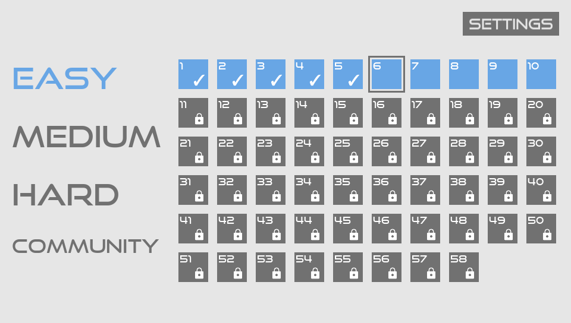
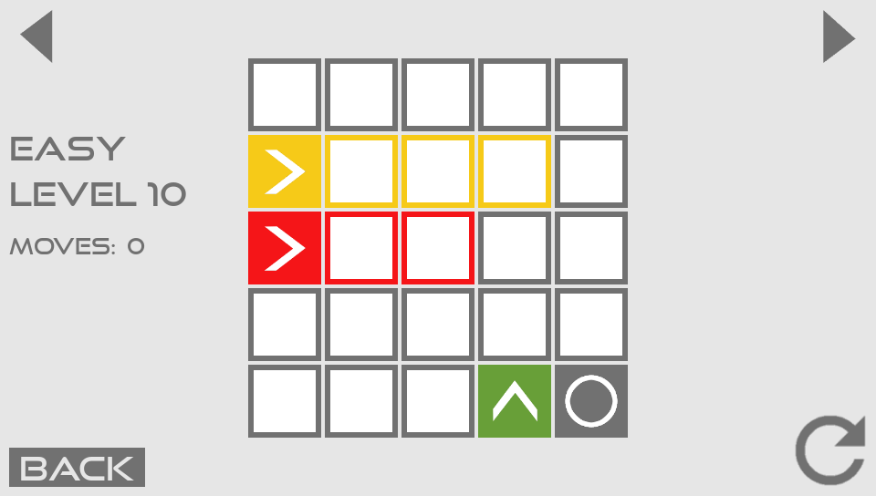
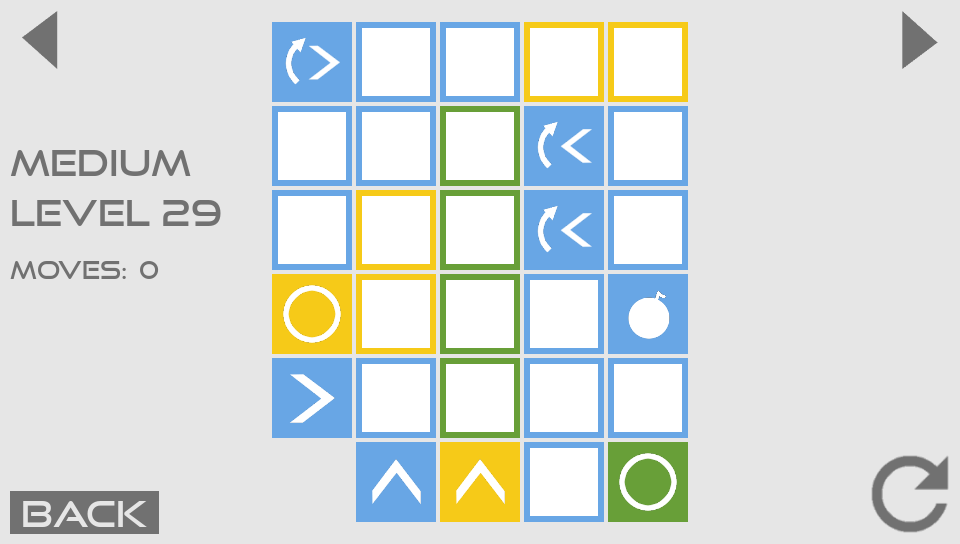

# Flowit-Vita / Flowit-Desktop
A port of the puzzle game [Flowit](https://github.com/Flowit-Game/Flowit/) by ByteHamster. The original is an Android app written in Java; this is a reimplementation written in Lua. The port runs on desktop and PlayStation Vita.
The desktop port is based on [LÖVE](https://love2d.org) and the Vita port uses [Lua Player Plus Vita](https://github.com/Rinnegatamante/lpp-vita) by Rinnegatamante.

## Screenshots

## Running on desktop
### Linux
First, install the [LÖVE](https://love2d.org) engine . The LÖVE package is available in the repositories of Ubuntu, Debian, Arch, Fedora, etc.; additional installation options are available on the website.

To run from the release, download the `flowit.love` release file. The system should recognize it as a LÖVE executable. Otherwise, run from the command line by executing `love /path/to/flowit.love`.

To build for Linux, clone the source and execute `./build_desktop`; this will produce the `flowit.love` file which can then be executed.

The app can also be run directly from the source without any packaging. Just clone the repository and execute `love .` from the top directory.

### Windows
To run from the release, download and unzip the `flowit-win` release file, then run `Flowit.exe`.

To build the Windows executable on Linux, clone the source and execute `./build_desktop --win` (note that this will not set the Flowit icon for the executable; that must be done from Windows or wine).

To build the Windows executable on Windows, follow the [instructions](https://love2d.org/wiki/Game_Distribution) on the LÖVE wiki (building Flowit on Windows has not been tested).

### Mac
To run from the release, download and unzip the `Flowit-mac` release file, then run `Flowit.app`.

To build the Mac app on Linux, clone the source and execute `./build_desktop --mac`. This build process should work on Mac also, but has not been tested.

## Running on PS Vita
Download the latest VPK release file and sideload it using VitaShell or similar.

Gameplay depends on the touchscreen, so the experience is better on the handheld PS Vita than on PS TV.

### Building (packaging VPK)
On Linux, enter the `flowit-vita` directory and execute `./build.sh` (this requires `vita-mksfoex` from [VitaSDK](https://vitasdk.org)).

The `eboot.bin` file is compiled from [Lua Player Plus](https://github.com/Rinnegatamante/lpp-vita). To build that for yourself as well, note that you need a version of Lua Player Plus recent enough to include text width and height detection (added in [this commit](https://github.com/Rinnegatamante/lpp-vita/commit/8124c469d6b8c43d1567b253a3ba13c6e0dcaa67)).

## Making levels
New levels can be created using the online editor at [https://flowit.bytehamster.com](https://flowit.bytehamster.com) and contributed [upstream](https://github.com/Flowit-Game/Flowit/). Alternatively, you can create levels and append the resulting XML to the level packs in `assets/levels/`.

## Languages
The app can run in English, Chinese (中文), or Japanese (日本語). Localization strings are in `lib/translation.lua`.

## License
Licenses for the bundled fonts can be found in the `fonts/` directory.

Jonathan Poelen's [xmlparser](https://github.com/jonathanpoelen/xmlparser) library and Egor Malyutin's [hlp](https://github.com/egormalyutin/hlp) library are included under their original MIT licenses.

Other files and code are released under GPLv3.
